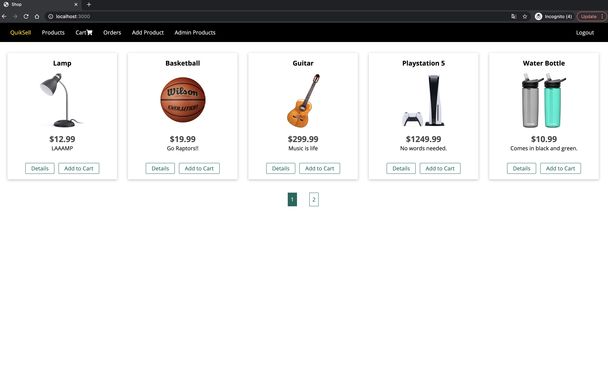

# quiksell
A simple eCommerce website where any registered user can buy/sell products. Built mainly with Node.js and Express along with a MongoDB database.

No front-end framework used, since I was mainly practicing using Node.js on the back-end. I decided to go with dynamic server side rendering with EJS to keep things simple.

Also integrated Stripe for payment.

Screenshot:

